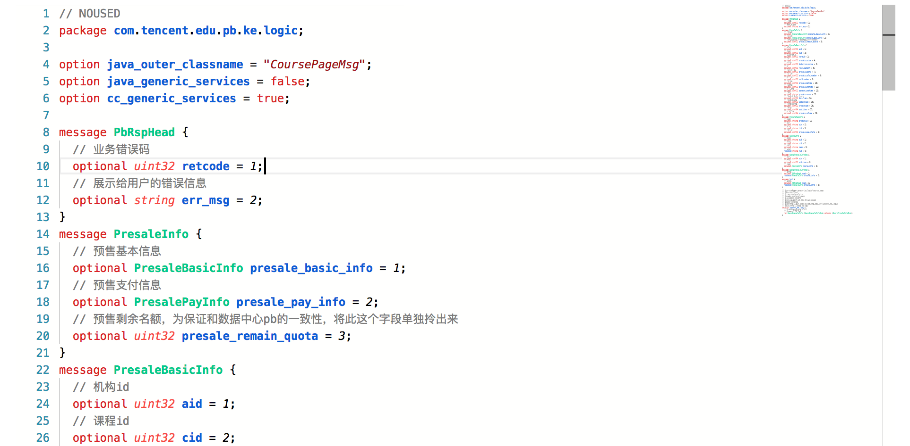

# monaco-proto
Supporting Protobuf language for monaco-editor

## Install
`npm i -S monaco-proto`

## Usage
```javascript
import registerProtobuf from 'monaco-proto';


// Register protobuf language
registerProtobuf(monaco);

// Create protobuf editor
monaco.editor.create(document.getElementById("container"), {
	language: "protobuf",
	theme: "protobuf"
});
```

## Preview
